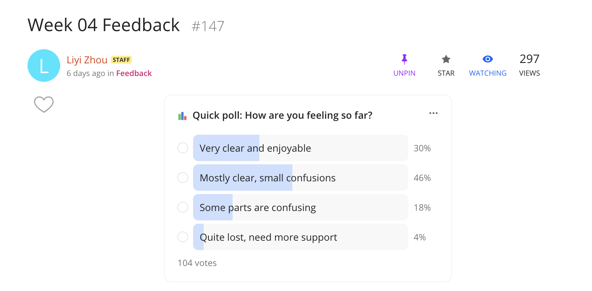
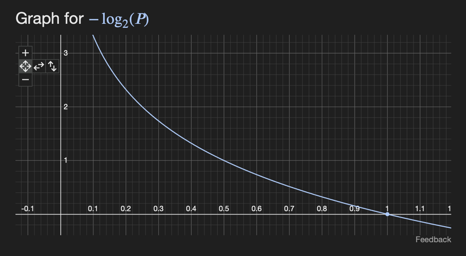
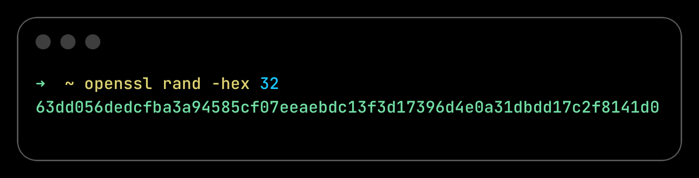
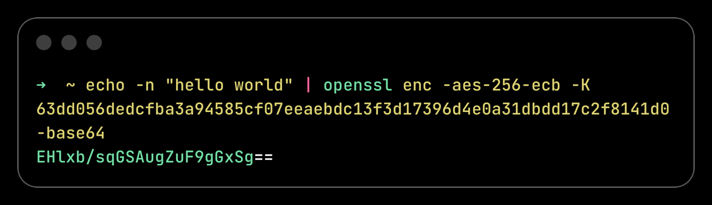
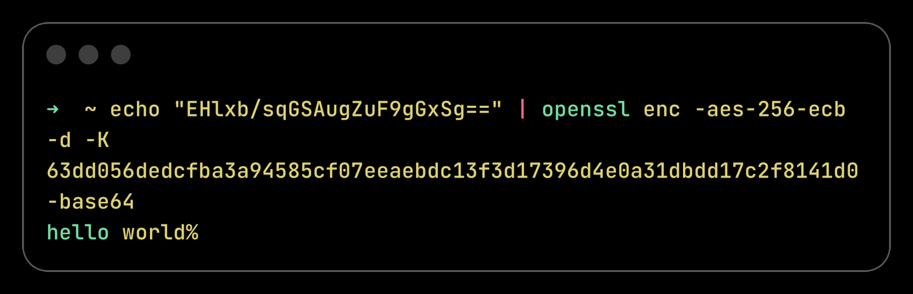
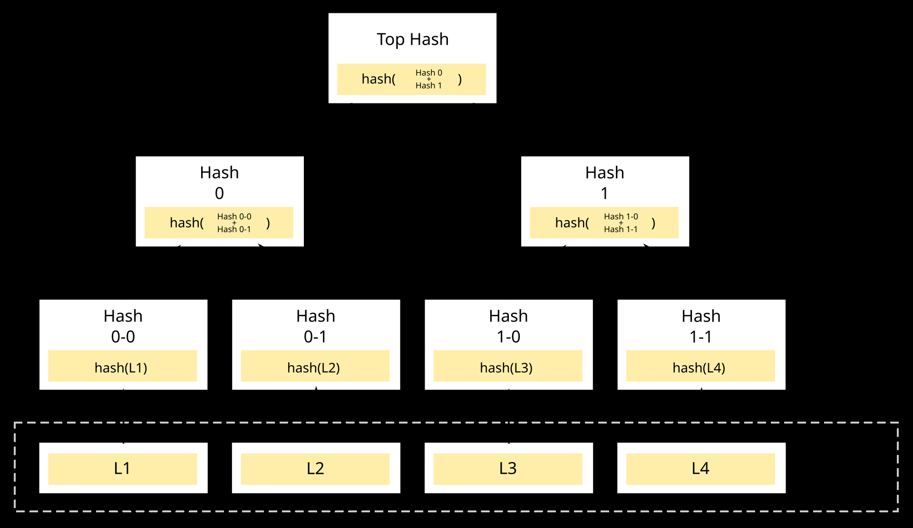
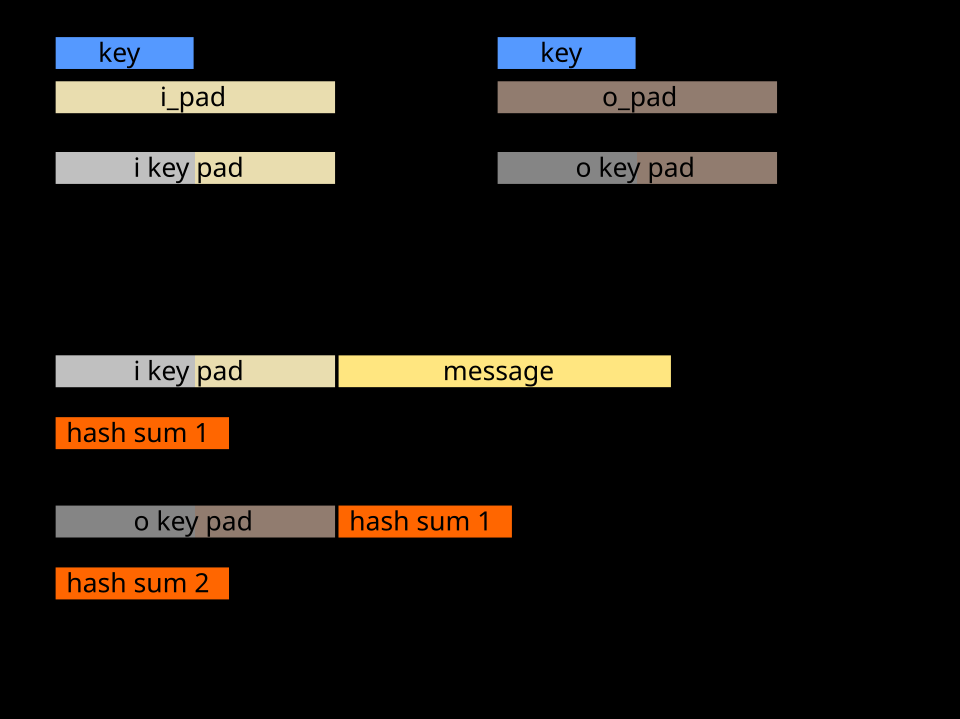

# Page 1
INFO5995
Cryptography Basics
Part 2

# Page 2
Feedback
Let’s go a bit more 
slowly to make sure 
everyone can follow.

# Page 3
Drop-in Session
Let’s go with Tuesday 
afternoon: 4pm-5pm for now

# Page 4
Hackers in the wild…

# Page 5
FOMO
Please help me by identifying 
more vulnerabilities.

# Page 6
Student Representative

# Page 7
Exam (subject to change)
• MCQs and MAQs
• MCQs – four choices
• MAQs – four choices, two correct
• ”Exact" grading
• i.e. 0 marks unless you get all the MAQ correct and none wrong

# Page 8
Recap Hash Function

# Page 9
Hash Function
• Mathematical formula that transform messages into deterministic, fixed-
length “representational string”
• More formally:
• Hash(pre-image) = digest
Legacy
MD5, SHA1
Modern
SHA224, SHA256, SHA384, SHA512
Future
SHA3-224, SHA3-256, SHA3-384, SHA3-512

# Page 10
Hash Function Properties
• Avalanche Effect: a slight change in input results in a significantly different 
digest
• Deterministic: the same pre-image always produces the same digest
• One-wayness (preimage resistance): given a hash digest h(x), it’s 
computationally hard to find the original input x
• Second pre-image resistance: Given an input x and its hash h(x), it’s 
computationally hard (practically impossible) to find a different input x’ != x 
such that h(x’) = h(x)
• Collision resistance: Collisions do exist in theory, but attackers cannot 
(practically impossible) find two inputs, x and y, such that h(x) = h(y)

# Page 11
Hash Function Properties
• Hash functions are designed to be very efficient
• Runs in time proportional to input size, i.e., linear time, O(n).
• Very fast in practice
• There are special hash functions that are intentionally slow
• Complexity wise, still linear time
• Slow on purpose to resist brute force attacks  more about these later in the unit
• Hash functions can be used in “creative ways”
• E.g., Proof-of-work (see lecture 4 recording)

# Page 12
Recap 
Kerckhoffs’s Principle,
Key Generation,
PRG, Entropy,

# Page 13
Kerckhoffs’s Principle
• Security by Obscurity
• Security by Transparency
• The security of a system should depend on its key, not on its design remaining obscure.
• More formally:
• F(key, inputs) → outputs

# Page 14
Key Generation
• Definition: Sequence of 1’s and 0’s used in Cryptography
• Goal: we need uniform, high-entropy, cryptographically secure 
randomness—not just randomness that looks random.
• Uniform randomness: no bias, no “more likely” outcomes
• High entropy: there are “many” possible combinations when we select the key
• Cryptographically secure: the randomness comes from a secure source—one that can’t 
be predicted, even if the attacker knows the system

# Page 15
Entropy
This slide is not examinable, but helps your understanding
• Formal definition (Shannon entropy)
• Let 𝑋 be a discrete random variable with possible values 𝑥∈𝑋 and probability 
distribution 𝑃𝑋= 𝑥.
• 𝐻(𝑋) = −σ𝑥∈𝑋𝑃𝑋= 𝑥𝑙𝑜𝑔2𝑃[𝑋= 𝑥]
• 𝑙𝑜𝑔2 here to make sure the entropy of two independent events can add up
• 𝐻𝑋, 𝑌= 𝐻𝑋+ 𝐻(𝑌)
• -𝑙𝑜𝑔2𝑃[𝑋= 𝑥] measures entropy/uncertainty of a single event, intuitively:
• Rare event → “very surprising” → brings more uncertainty → entropy should be high
• Common event → “less surprising” → brings less uncertainty → entropy should be low
• When X is uniform, H(x) = -𝑙𝑜𝑔2𝑃[𝑋= 𝑥]
• There are many other entropies, e.g.,
• Min entropy 𝐻∞𝑋= −𝑙𝑜𝑔2 𝑚𝑎𝑥𝑥𝑃𝑋= 𝑥, measures worst case predictability

# Page 16
Entropy (Naïve Intuition)
This slide is examinable
• Think of entropy as: how many possibilities are there, and how evenly we 
choose among them.
• Size of the pool (number of possibilities)
• Large pool → higher entropy
• Small pool → lower entropy
• Only one value → entropy = 0
• How we choose (distribution)
• Uniform choice → highest entropy
• Biased choice → lower entropy
• One fixed value → 0 entropy
• E.g., picking `000000` as the key, you are picking in a pool with only 1 possibility.

# Page 17
We cannot get large amounts of true 
randomness, so we generate it.
• True randomness → physical source
• E.g., hardware noise etc.
• Slow (performance bottleneck), Instable (can be blocking)
• PRNG (Pseudorandom Number Generator) 
→ algorithm + seed
• Non-cryptographic PRNG
• Seed comes from “easy”, “predictable” sources
• Timestamp, process id, system clock, etc.
• CSPRNG
• Seed comes from a physical (true random) source
• Output itself is generated algorithmically

# Page 18
PRG, PRNG, CSPRNG, Non-cryptographic PRNG
CSPRNG
“implementation”
Non-Cryptographic
PRNG
Pseudorandom Number 
Generator (PRNG)
PRG
“definition”
Theory
Implementation
Roughly 
the same

# Page 19
Pseudorandom Generator (PRG)
PRG is the formal crypto definition, CSPRNG is the implementation
• A PRG is defined via computational indistinguishability.
• More formally:
• 𝐺: {0, 1}𝑛→{0,1}𝑙(𝑛)
• Input is a short seed of length 𝑛
• Output is a longer string 𝑙𝑛> 𝑛
• It is secure if no efficient algorithm can distinguish 𝐺𝑠 from a truly random string of length 
𝑙𝑛
• Intuitively
• It stretches randomness, from a small sequence to a long sequence
• Loos random to any efficient attacker

# Page 20
What “secure randomness” means?
• Goal: Looks like true randomness
• CSPRNG security intuition:
• Output should look random to any efficient attacker
• Even if the attacker sees many outputs

# Page 21
Computational Indistinguishability
R = PRG(K)
Long random K
Distinguisher
But returns the same
Can launch all kinds of tests

# Page 22
Hash vs. PRG?
PRG (CSPRNG)
Hash
Goal
Generate randomness
“Compress data”
Input
Short seed
Arbitrary data
Output
Very very long stream
Fixed size
Deterministic
Yes
Yes

# Page 23
Symmetric Crypto

# Page 24
Symmetric 
Encryption 
Example
Symmetric Crypto

# Page 25
Key Generation (AES Example)
• Key generation
• K←Gen()
• Input: none
• Output: secret key
Alice
Bob

# Page 26
Key Generation (AES Example)
Alice
Bob
Somehow Bob receives 
the key Alice generated
More about this later…

# Page 27
Encryption (AES Example)
• Encryption
• C=Enc(K,M) 
• K: secret key
• M: plaintext
• C: ciphertext
Alice
Bob
hello world
Ehlxb/sq…

# Page 28
Decryption (AES Example)
• Decryption
• M=Dec(K,C) 
• M: plaintext
• K: secret key
• C: ciphertext
Alice
Bob
Ehlxb/sq…
hello world

# Page 29
AES has “different modes”
ECB mode
-
Simple
-
Fast
-
Sometimes “good 
enough”
-
If your data has 
structure, ECB 
leaks it
More about this later

# Page 30
Perfect Secrecy
Symmetric Crypto

# Page 31
Algorithms like AES is secure, 
but not perfectly secure
• Perfect Secrecy:
• Most Strict Goal: 
• The attacker wants to learn “something” about only one bit of the message.
• Strongest Capability: 
• The attacker can have unlimited physical resources: time, space, memory, and sees one 
target ciphertext
• More formally:
• 𝑃(𝑀= 𝑚|𝐶= 𝑐) = 𝑃(𝑀= 𝑚)
• In other words:
• The “strongest / all-mighty” attacker learns nothing, even if it can see all the ciphertext.

# Page 32
One-time Pad (OTP)
• One-time pad (OTP) is one of the symmetric encryption algorithms.
• Key is as long as the message
• Key must be truly random
• Key must never be reused
• OTP is not practical (too much overhead), but it is perfectly secure.

# Page 33
Key Generation (OTP Example)
H  01001000
E  01000101
L  01001100
L  01001100
O  01001111
   00100000
W  01010111
O  01001111
R  01010010
L  01001100
D  01000100
Alice
Message M:
01001000 01000101 01001100
01001100 01001111 00100000
01010111 01001111 01010010
01001100 01000100

# Page 34
Key Generation (OTP Example)
Alice
Bob
Message M:
01001000 01000101 01001100
01001100 01001111 00100000
01010111 01001111 01010010
01001100 01000100
Random Key K:
10110110 01101001 11001010 00111001 
11100010 01011100
10010011 00101101 01110100 00011110 
10101001

# Page 35
Key Generation (OTP Example)
Alice
Bob
Key K:
10110110 01101001 11001010 00111001 
11100010 01011100
10010011 00101101 01110100 00011110 
10101001
Somehow both Alice and Bob 
have the keys. 🫠
More about this later

# Page 36
Key Generation (OTP Example, Encrypt)
Alice
Message M:
01001000 01000101 01001100
01001100 01001111 00100000
01010111 01001111 01010010
01001100 01000100
Key K:
10110110 01101001 11001010 00111001 
11100010 01011100
10010011 00101101 01110100 00011110 
10101001
Cipher text C = M ⊕ K
01001000 ⊕ 10110110 = 11111110
01000101 ⊕ 01101001 = 00101100
01001100 ⊕ 11001010 = 10000110
01001100 ⊕ 00111001 = 01110101
01001111 ⊕ 11100010 = 10101101
00100000 ⊕ 01011100 = 01111100
01010111 ⊕ 10010011 = 11000100
01001111 ⊕ 00101101 = 01100010
01010010 ⊕ 01110100 = 00100110
01001100 ⊕ 00011110 = 01010010
01000100 ⊕ 10101001 = 11101101

# Page 37
Key Generation (OTP Example)
Alice
Cipher text C = M ⊕ K
01001000 ⊕ 10110110 = 11111110
01000101 ⊕ 01101001 = 00101100
01001100 ⊕ 11001010 = 10000110
01001100 ⊕ 00111001 = 01110101
01001111 ⊕ 11100010 = 10101101
00100000 ⊕ 01011100 = 01111100
01010111 ⊕ 10010011 = 11000100
01001111 ⊕ 00101101 = 01100010
01010010 ⊕ 01110100 = 00100110
01001100 ⊕ 00011110 = 01010010
01000100 ⊕ 10101001 = 11101101
Cipher text C
11111110 00101100 10000110 01110101 
10101101 01111100
11000100 01100010 00100110 01010010 
11101101

# Page 38
Key Generation (OTP Example, Decrypt)
Bob
Key K:
10110110 01101001 11001010 00111001 
11100010 01011100
10010011 00101101 01110100 00011110 
10101001
Cipher text C
11111110 00101100 10000110 01110101 
10101101 01111100
11000100 01100010 00100110 01010010 
11101101
Message M = C ⊕ K
01001000 01000101 01001100
01001100 01001111 00100000
01010111 01001111 01010010
01001100 01000100

# Page 39
OTP Satisfies Perfect Secrecy
𝑃(𝑀= 𝑚|𝐶= 𝑐) = 𝑃(𝑀= 𝑚)
Cipher text C
11111110 00101100 10000110 01110101 
10101101 01111100
11000100 01100010 00100110 01010010 
11101101
The first bit is 1, but I do not know the secret key.
The key could be either 0 or 1.
The message could also be either 0 or 1.
i.e., seeing the first bit of the ciphertext does not 
give me any information about the first bit of the 
message

# Page 40
OTP Satisfies Perfect Secrecy
𝑃(𝑀= 𝑚|𝐶= 𝑐) = 𝑃(𝑀= 𝑚)
Cipher text C
11111110 00101100 10000110 01110101 
10101101 01111100
11000100 01100010 00100110 01010010 
11101101
Knowing the first bit of the ciphertext, also gives me 
no information about other bits, i.e., the entire 
computation was independent per bit

# Page 41
The “Curse” of Perfect Secrecy
𝑃(𝑀= 𝑚|𝐶= 𝑐) = 𝑃(𝑀= 𝑚)
• Shannon proved mathematically that no encryption scheme can achieve 
perfect secrecy unless the key has at least as much entropy as the 
message and is used only once.

# Page 42
Curse of Perfect Secrecy
Intuition behind the proof, not the actual proof.
• Suppose we have:
• Messages (M): 
00, 01, 10, 11 
(4 possible choices)
• Keys (K): 
00, 01  
(smaller in entropy, only two possible choices)
• Compute all the possible Ciphertext, C=M⊕K, only three possibilities: 00, 01, 11.
• 00 ⊕ 00 = 00, 00 ⊕ 01 = 01, 01 ⊕ 00 = 01, 01 ⊕ 01 = 00
• 10 ⊕ 00 = 10, 10 ⊕ 01 = 11, 11 ⊕ 00 = 11, 11 ⊕ 01 = 10
• Suppose we observe the ciphertext C= 11. The only possible plain text are: 10 and 11.
• The first bit for plaintext is then 1.
• The attacker learnt “something” (doesn’t mean the attacker knows the plaintext).

# Page 43
Do We Really Need Perfect Secrecy?
• Semantic Security
• Formalized by Shafi Goldwasser and Silvio Micali (1980s, Turing Award 2012)
• Instead of requiring that ciphertexts leak nothing (in an absolute sense), they require 
that:
• No efficient (i.e., polynomial-time) attacker can learn anything significant from the ciphertext
• In comparison to perfect secrecy:
• Attacker is slightly weaker
• Security goal is also less strict

# Page 44
Semantic Security vs. Perfect Secrecy
Property
Perfect Secrecy
Semantic Security
Attacker power
Theoretically unlimited
Efficient only
Information leakage
Theoretically zero
None efficiently extractable
Practical
 (impractical)
 (used everywhere)
Some people say Semantic Security is a “computational equivalent” of Perfect Secrecy
•
Same “intuition”
•
Perfect secrecy → information-theoretic guarantee
•
Semantic security → computational guarantee (more practical)

# Page 45
Major Efforts for Modern Cryptography
• Under Semantic Security
• Challenge 1: How to encrypt with a “short key”.
• Challenge 2: How to use the same “short key”.

# Page 46
Challenge 1: How to Encrypt With a “Short Key”
M (plaintext)
K (secret key)
C (ciphertext)

# Page 47
Challenge 1: How to Encrypt With a “Short Key”
Stretch the short key into a longer 
key that fits the encryption 
requirements.
This makes encryption feasible 
with shorter keys while preserving 
strong security properties.
K
M (plaintext)
R (Stretched key)
C (ciphertext)
Pause here:
Which function should we use?

# Page 48
Step 1 (key stretching)
A short secret key (K) is fed into a pseudorandom generator (PRG) to produce a longer, 
secure key (R).
Step 2 (encryption)
This stretched key (R) is then used to encrypt the plaintext (M), producing ciphertext (C).
K
M (plaintext)
R (stretched key)
C (ciphertext)
PRG
Challenge 1: How to Encrypt With a “Short Key”

# Page 49
Step 1 (key stretching again)
The same short key (K) is stretched again through the same PRG to regenerate the longer 
key (R).
Step 2 (decryption)
The stretched key (R) is used to decrypt the ciphertext (C), recovering the original plaintext 
message (M).
K
C (ciphertext)
R (stretched key)
M (plaintext)
PRG
Challenge 1: How to Encrypt With a “Short Key”

# Page 50
Can we reuse K?
K
C (ciphertext)
R (stretched key)
M (plaintext)
PRG
R (stretched key)
R (stretched key)
R (stretched key)
C (ciphertext)
C (ciphertext)
C (ciphertext)
M (plaintext)
M (plaintext)
M (plaintext)
R (stretched key)
R (stretched key)
R (stretched key)
R (stretched key)
R (stretched key)
R (stretched key)
C (ciphertext)
C (ciphertext)
C (ciphertext)
C (ciphertext)
C (ciphertext)
C (ciphertext)
M (plaintext)
M (plaintext)
M (plaintext)
M (plaintext)
M (plaintext)
M (plaintext)

# Page 51
We can’t reuse keys
C1 ⊕ C2 = M1 ⊕ M2
• C1 = M1 ⊕ R
• C2 = M2 ⊕ R
• C1 ⊕ C2 = M1 ⊕ R ⊕ M2 ⊕ R = M1 ⊕ M2 ⊕ R ⊕ R = M1 ⊕ M2
• Therefore:
• If C1 ⊕ C2 = 0, then M1 == M2 (either they are both 1, or both 0)
• If C1 ⊕ C2 = 1, then M1 != M2

# Page 52
Can we reuse K?
K
C (ciphertext)
R (stretched key)
M (plaintext)
PRG
R (stretched key)
R (stretched key)
R (stretched key)
C (ciphertext)
C (ciphertext)
C (ciphertext)
M (plaintext)
M (plaintext)
M (plaintext)
R (stretched key)
R (stretched key)
R (stretched key)
R (stretched key)
R (stretched key)
R (stretched key)
C (ciphertext)
C (ciphertext)
C (ciphertext)
C (ciphertext)
C (ciphertext)
C (ciphertext)
M (plaintext)
M (plaintext)
M (plaintext)
M (plaintext)
M (plaintext)
M (plaintext)
Observes C
Tries to infer stretched key

# Page 53
Challenge 2: How to use the same “short key”.
• Same K → same R
• C1 ⊕ C2 = M1 ⊕ M2
• key reuse problem
• leaks information
• So how do we fix it?
K
C (ciphertext)
R (stretched key)
PRG
R (stretched key)
R (stretched key)
R (stretched key)
C (ciphertext)
C (ciphertext)
C (ciphertext)
R (stretched key)
R (stretched key)
R (stretched key)
R (stretched key)
R (stretched key)
R (stretched key)
C (ciphertext)
C (ciphertext)
C (ciphertext)
C (ciphertext)
C (ciphertext)
C (ciphertext)
Observes C
Tries to infer stretched key

# Page 54
Stream Cipher (state dependent mode)
K
M_i (plaintext)
R_i
C_i (ciphertext)
PRG
i
R_i
R_i
R_i
R_i
R_i
R_i
R_i
R_i
R_i
M_i (plaintext)
M_i (plaintext)
M_i (plaintext)
M_i (plaintext)
M_i (plaintext)
M_i (plaintext)
M_i (plaintext)
M_i (plaintext)
M_i (plaintext)
C_i (ciphertext)
C_i (ciphertext)
C_i (ciphertext)
C_i (ciphertext)
C_i (ciphertext)
C_i (ciphertext)
C_i (ciphertext)
C_i (ciphertext)
C_i (ciphertext)
i i i i i i i i i

# Page 55
Pu
Stream Cipher (state dependent mode)
C_i (ciphertext)
C_i (ciphertext)
C_i (ciphertext)
C_i (ciphertext)
C_i (ciphertext)
C_i (ciphertext)
C_i (ciphertext)
C_i (ciphertext)
C_i (ciphertext)
C_i (ciphertext)
M_i (plaintext)
M_i (plaintext)
M_i (plaintext)
M_i (plaintext)
M_i (plaintext)
M_i (plaintext)
M_i (plaintext)
M_i (plaintext)
M_i (plaintext)
M_i (plaintext)
Public

# Page 56
Stream Cipher (state dependent mode)
K
C_i (ciphertext)
R_i
M_i (plaintext)
PRG
i i i i i i i i i i
R_i
R_i
R_i
R_i
R_i
R_i
R_i
R_i
R_i
C_i (ciphertext)
C_i (ciphertext)
C_i (ciphertext)
C_i (ciphertext)
C_i (ciphertext)
C_i (ciphertext)
C_i (ciphertext)
C_i (ciphertext)
C_i (ciphertext)
M_i (plaintext)
M_i (plaintext)
M_i (plaintext)
M_i (plaintext)
M_i (plaintext)
M_i (plaintext)
M_i (plaintext)
M_i (plaintext)
M_i (plaintext)

# Page 57
Stream Cipher (state dependent, counter mode)
• What is the problem?
• How can we improve?

# Page 58
Stream Cipher (stateless)
K
M_i (plaintext)
R_i
C_i (ciphertext)
PRG
i
R_i
R_i
R_i
R_i
R_i
R_i
R_i
R_i
R_i
M_i (plaintext)
M_i (plaintext)
M_i (plaintext)
M_i (plaintext)
M_i (plaintext)
M_i (plaintext)
M_i (plaintext)
M_i (plaintext)
M_i (plaintext)
C_i (ciphertext)
C_i (ciphertext)
C_i (ciphertext)
C_i (ciphertext)
C_i (ciphertext)
C_i (ciphertext)
C_i (ciphertext)
C_i (ciphertext)
C_i (ciphertext)
i i i i i i i i
nonce

# Page 59
Stream Cipher (stateless)
C_i (ciphertext)
C_i (ciphertext)
C_i (ciphertext)
C_i (ciphertext)
C_i (ciphertext)
C_i (ciphertext)
C_i (ciphertext)
C_i (ciphertext)
C_i (ciphertext)
C_i (ciphertext)
M_i (plaintext)
M_i (plaintext)
M_i (plaintext)
M_i (plaintext)
M_i (plaintext)
M_i (plaintext)
M_i (plaintext)
M_i (plaintext)
M_i (plaintext)
M_i (plaintext)
nonce
nonce
nonce
nonce
nonce
nonce
nonce
nonce
nonce
nonce
nonce
nonce
nonce
nonce
nonce
nonce
nonce
nonce
nonce
nonce
Public

# Page 60
Stream Cipher (stateless)
K
C_i (ciphertext)
R_i
M_i (plaintext)
PRG
R_i
R_i
R_i
R_i
R_i
R_i
R_i
R_i
R_i
C_i (ciphertext)
C_i (ciphertext)
C_i (ciphertext)
C_i (ciphertext)
C_i (ciphertext)
C_i (ciphertext)
C_i (ciphertext)
C_i (ciphertext)
C_i (ciphertext)
M_i (plaintext)
M_i (plaintext)
M_i (plaintext)
M_i (plaintext)
M_i (plaintext)
M_i (plaintext)
M_i (plaintext)
M_i (plaintext)
M_i (plaintext)
i i i i i i i i i
nonce

# Page 61
Stream Cipher
• Encrypts data bit-by-bit or byte-by-byte
• Generates a keystream from a short secret key
• keystream = PRG(K, nonce)
• Combines keystream with plaintext (usually by XOR) to produce ciphertext
• C = M ⊕ keystream
• Naturally handles data streams — no padding needed
• Real world examples:
• Software: RC4 (historically popular, now insecure), ChaCha20 (modern, fast, secure)
• Hardware: A5/1, A5/2 (GSM), E0 (Bluetooth) — many broken due to weak PRGs

# Page 62
What we have so far…
• OTP
• perfect but impractical
• PRG:
• generate long key from “short randomness”
• Stream cipher:
• fix reuse with “nonce”

# Page 63
Another approach
• Stream ciphers work well, but they are a bit fragile if not designed well…
• Can we design something more structured?
• Instead of XOR with a keystream, can we encrypt block by block
• We try to remove the complicated “state management”
Plain text stream……
Key stream……
Ciphertext stream…..
Plain text
FK(input)
Ciphertext
Infinite
Length
Fixed
Length
Pad

# Page 64
Block Cipher
• Let’s assume we already have a very strong encryption/decryption function, 
called a block cipher, like AES.
• FK: {0,1} n → {0,1}n
• Takes a “fixed-size” block
• Uses a key
• Outputs another block
• Pseudorandom -- behaves like a random permutation
• C1 ⊕ C2  does not reveal M1 ⊕ M2
Plain text
FK(input)
Ciphertext
Fixed
Length
Pad

# Page 65
AES as an example
• C = AES (M, K)
• AES is not a simple formula. It is a sequence of rounds that transform the input block 
using the key.
• C = Roundn(...Round2(Round1(M, K)..., K)    Just to show you this is complicated
• There are four operations in each round
• SubBytes
• ShiftRows 
• MixColumns
• AddRoundKey
• Some non-linear mixing, permutation and XOR

# Page 66
Block cipher Lego
• Block ciphers are like Lego blocks
• We can build many modes, although some are not secure…

# Page 67
AES-ECB (Electronic Codebook)
M_1
M_2
M_3
M_i
…
C_1
C_2
C_3
C_i
…
AES_enc
AES_enc
AES_enc
AES_enc

# Page 68
AES-ECB
M_1
M_2
M_3
M_i
…
C_1
C_2
C_3
C_i
…
AES_dec
AES_dec
AES_dec
AES_dec

# Page 69
AES-ECB
• Even though AES is strong, and C1 ⊕ C2  does not reveal M1 ⊕ M2
• ECB can still reveal information
• Why?

# Page 70
AES-ECB

# Page 71
AES-CBC (Cipher Block Chaining)
M_1
M_2
M_3
M_i
…
C_1
C_2
C_3
C_i
…
AES_enc
AES_enc
AES_enc
AES_enc
Initial Vector
xor
xor
xor

# Page 72
AES-CBC (Cipher Block Chaining)
M_1
M_2
M_3
M_i
…
C_1
C_2
C_3
C_i
…
AES_dec
AES_dec
AES_dec
AES_dec
xor
xor
xor
Initial Vector

# Page 73
AES-CBC

# Page 74
AES-CTR (Counter Mode), Encryption
Basically stream cipher
i_1
i_2
i_3
i_i
…
Key_1
Key_2
Key_3
Key_i
…
AES_enc
AES_enc
AES_enc
AES_enc
C_1
C_2
C_3
C_i
…
M_1
M_2
M_3
M_i
…
“Key 
stream”
Plain text
stream

# Page 75
AES-CTR (Counter Mode), Decryption
Basically stream cipher
i_1
i_2
i_3
i_i
…
Key_1
Key_2
Key_3
Key_i
…
AES_enc
AES_enc
AES_enc
AES_enc
C_1
C_2
C_3
C_i
…
M_1
M_2
M_3
M_i
…
“Key 
stream”
Plain text
stream

# Page 76
Common Symmetric Encryption Algorithms
Legacy
DES, RC4, 3DES
Modern
AES-128, AES-192, AES-256, ChaCha20
Future
AES & ChaCha20 are Quantum Safe

# Page 77
Beyond Confidentiality

# Page 78
Is this enough?
• Confidentiality:
• C = Enc(K, M)
• Hide the message
• Now the attacker cannot read the message
• Can the attacker still do something? (Pause here, think)

# Page 79
Attacker 1 (modification)
• The attacker cannot read the message, but can still change it.
• Attacker modifies C → C’

# Page 80
Attacker 1 (modification)
• When Alice sends ciphertext “1001” to Bob, Eve can perform an attack to 
change the ciphertext from “1001” to “1101”; Bob will not be able to tell.
• “Hi Alice, please send $500 to account number 123-456.”
• “Hi $£ice, please send $500 to account number 123-456.”
• “Hi Alice, please send $770 to account number 123-456.”
• (If Eve is lucky).

# Page 81
Attacker 2 (Forgery / Replay / Imitation)
• Example 1
Extend assignment 
deadline by 1 day
Replay
Extend assignment 
deadline by 1 day

# Page 82
Attacker 2 (Forgery / Replay / Imitation)
• Example 2
Alice Fail
Bob HD
Alice HD
Copy Paste

# Page 83
Attacker 2 (Forgery / Replay / Imitation)
• The message looks valid, but it may not be sent by the real sender.
• We need a mechanism to verify sender

# Page 84
Message Integrity
(detect any modification)

# Page 85
Let’s forget about confidentiality for a while
Alice
Bob

# Page 86
Message Integrity (Naïve)
• Digest1 = Hash(Message 1)
• Digest2 = Hash(Message 2)
• ……
• Avalanche effect

# Page 87
Message Integrity (Lots of messages)
• Imagine Alice now have “lots of messages” to check
• Not common in communication, but let’s say, Alice has lots of files on the cloud
• Alice wants to only store one digest, in order to validate all the files
• Is that possible?

# Page 88
Message Integrity (Merkle Tree)

# Page 89
Is Hashing Enough?
Alice
Bob
hash

# Page 90
Is Hashing Enough? (pause here)
Alice
Bob
hash

# Page 91
Hashing is not enough
Alice
Bob
hash
hash
hash

# Page 92
Message Authenticity
+ Message Integrity
MAC/HMAC

# Page 93
The high-level idea
Alice
Bob
key
key

# Page 94
The high-level idea
Alice
Bob
hash
key
key
key

# Page 95
The high-level idea
Alice
Bob
key
key
hash

# Page 96
The high-level idea
Alice
Bob
key
key
hash
key

# Page 97
Message Authentication Code (MAC)
• Key generation: K←Gen()
• Tag: T = Tag(K,M)
• Verify: {0, 1} = Verify(K , M, T)
K
KeyGen
M
T
Tag
K
T
K
M
Verify
{0,1}

# Page 98
Attacker’s Goal
Modify or simply forge some message tags and still pass the verification (for 
both integrity and authenticity)
• Modify → take an existing message-tag and alter it
• Forge → creating something that is completely new

# Page 99
Is H(K || M) secure?
• Depends on the hashing algorithm
• It depends on the hash construction. Some hash functions like SHA-256 allow length 
extension attacks.
• Conceptually, some hash functions do “left to right iterative hashing”
• H(ABC) = f(f(f(IV, A), B), C)
• H(ABCD) = f(f(f(f(IV, A), B), C), D) = f(H(ABC), D)

# Page 100
H(K || M) is not secure
• Once attacker observes H(K || M), attacker may compute H(K || M || extra)
• Core Idea:
• Make sure MAC cannot reuse inner state

# Page 101
There are many ways to build a MAC
HMAC is one of them
• Two layered hashes
• No need to memorize the formula 
(you will be given the formula if there 
is a question about it).
• But if you are interested:
• H( (K ⊕ opad) || H((K ⊕ ipad) || M) )
• If H(K || M || extra)
• “outer hash (2nd pass)” will break, 
• “inner (1st pass) will not”
• So we can still detect the message 
being modified based on inner hash

# Page 102
MAC
Legacy
Modern
HMAC (1997), Poly 1305
Future
GCM, CCM (AEAD Ciphers)
Combines encryption + MAC in one 
(i.e., confidentiality, integrity and 
authenticity in one)

# Page 103
If you want to go deeper…
• Stronger security notions
• What does “secure encryption” really mean?
• IND-CPA (basic), IND-CCA (stronger)
• Authenticated Encryption (AEAD)
• Combine encryption + integrity
• AES-GCM (used in TLS, HTTPS), ChaCha20-Poly1305 (used in QUIC)
• Misuse resistance
• What if nonce is reused? Designing systems that are “hard to break”
• Example: AES-GCM-SIV
• Real-world attacks
• Padding oracle attacks, Nonce reuse failures, Side-channel attacks, …

# Page 104
Latest research directions:
• Safer cryptography (misuse-resistant designs)
• High-performance crypto (GPU / hardware acceleration)
• Post-quantum symmetric assumptions
• AI-assisted vulnerability discovery

# Page 105
